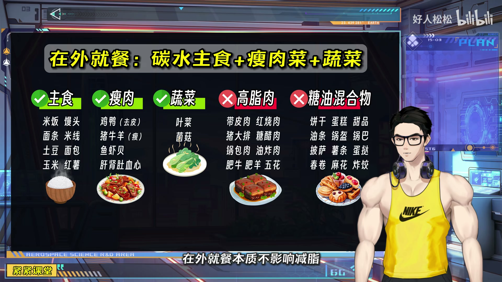
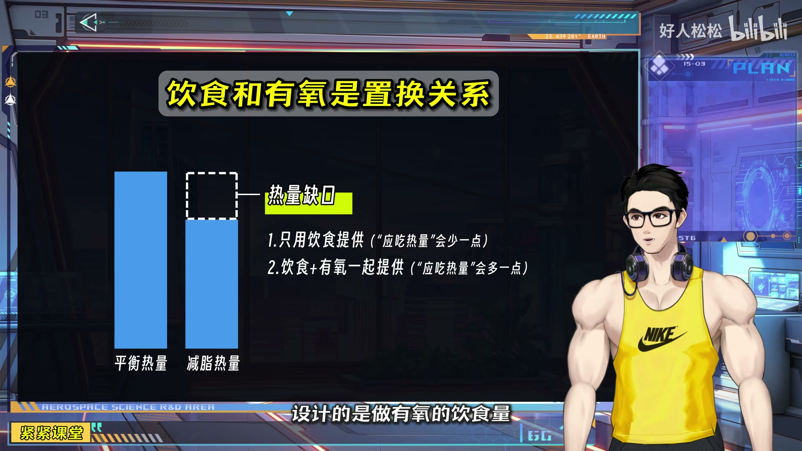

# 我用 Claude Code 做了个 B 站视频笔记神器

## 起因

先说背景。

我最近在做一个健身搭子相关的 AI 项目，叫 OpenClaw（龙虾）。做这个项目的过程中需要大量学习健身营养知识，B 站上有个 UP 主叫**好人松松**，他的视频真的深得我心——内容完善、体系完整、对新手特别友好。他不是那种"三分练七分吃"随便说说的博主，而是真的会给你算清楚一碗面条有多少克碳水、一个包子里的"瘦肉"其实全是五花肉这种硬核内容。

但问题来了。

他的视频动辄 15-20 分钟，干货密度极高。我看完一遍觉得都懂了，过两天想回去查某个知识点——拖进度条拖到崩溃。B 站的视频没有文字索引，搜也搜不到。

我试过记笔记，但手写跟不上语速，截图又截不到重点。

## 两条路

我想到两个方案。

**方案一：Get 笔记**。这个工具可以直接丢一个视频链接进去，它会自动分析生成笔记。说实话效果还不错，文字整理得挺清楚。但有一个硬伤——**不能截图关键帧**。好人松松的视频里有大量数据表格、营养对比图、饮食方案模板，这些东西纯文字描述根本不够，你得看到那张图才行。

**方案二：自己造一个。**

说来也巧，我在 WaytoAGI 的飞书知识库里刷到一篇文章，讲的是有人做了一个 Claude Code Skill，能把 YouTube 视频转成 LaTeX 学术 PDF，自动截取关键帧、配上时间戳、渲染成能打印的讲义。那篇文章看完了我就一个想法：这玩意儿能不能用在 B 站上？

技术上来说，关键帧截取用的是 ffmpeg，跟平台没关系。下载用的是 yt-dlp，B 站也是它支持的站点。唯一需要适配的就是 B 站特有的东西——多 P 视频、登录 cookie、CC 字幕之类的。

于是开干。

## 做了什么

我花了大概一个下午，做了一个 Claude Code Skill，叫 **bilibili-note**。

给它一个 B 站链接，它能做这些事：

1. 下载视频（自动带字幕和元数据）
2. 把音频完整转录成文字
3. AI 分析全部转录内容，生成结构化笔记
4. 在关键位置自动截取视频截图，插入笔记
5. 输出一份 Markdown 文件

整个过程大概 5-10 分钟（主要时间花在视频下载和音频转录上）。

## 实测案例

拿好人松松的《减脂平台期 9 种原因》来测了一下。

视频 16 分钟，讲的是减脂期间体重不掉的 9 个常见原因。

首先，工具自动下载了视频，然后用 mlx-whisper（苹果芯片本地跑的语音识别模型）花了大概 2 分钟转录了全部音频，识别出来 606 个语音片段。

然后 Claude 读了完整的转录文本，整理出了 9 个原因的结构化笔记，同时在合适的位置截取了 11 张关键帧截图。

这是其中一张——混合食物的碳蛋脂拆分示意图：

光看文字你很难理解"土豆烧牛肉为什么不应该有统一的营养数据"，但配着这张图就一目了然了——土豆、瘦肉、肥肉、植物油，四种原料的营养率完全不同，混在一起算就是一笔糊涂账。

再比如这张在外就餐指南：

左边绿色打勾的是推荐吃的（米饭、馒头、鸡鸭去皮、鱼虾），右边红色打叉的是要避开的（红烧肉、锅包肉、肥牛肥羊）。这种表格式的内容，如果笔记里没有截图，你光看文字描述根本记不住。

还有饮食和有氧的关系图：

"饮食和有氧是置换关系"——不爱跑步就少吃点，想多吃就多跑点。用柱状图对比一目了然。

最终输出的笔记长这样（Markdown 格式）：

- 标题 + 来源信息 + UP 主 + 时长
- 3-5 句话的摘要
- 按内容逻辑划分的详细章节（每章配关键帧截图）
- 要点总结（9 条核心建议）
- 时间索引表

比起我之前用 Get 笔记生成的纯文字版，内容丰富度完全是两个量级。

## 一些技术细节

如果你也想玩，简单说一下技术栈：

- **yt-dlp**：下载 B 站视频，支持字幕、cookie 登录、多 P
- **ffmpeg**：提取音频 + 按时间戳截取关键帧
- **mlx-whisper**：苹果芯片本地语音转录，不用联网，不用 API Key
- **Claude Code Skill**：编排整个工作流，AI 分析内容生成笔记

也支持用 OpenAI 的 Whisper API 做转录，如果你有 Key 的话。

## 最后

这个工具当然不是完美的。目前有几个我还在想的改进方向：

- **弹幕分析**：B 站弹幕密度大的地方往往是重点，可以用来辅助判断截图时间点
- **多视频整合**：把同一个 UP 主的多个视频合成一本"电子书"
- **飞书文档输出**：直接推到飞书文档里，方便分享和协作

开源地址在这里：https://github.com/CoooF/bilibili-note

如果你也在健身减脂，推荐去看看好人松松的视频。如果你也想把视频变成笔记，试试这个工具。

有问题欢迎在评论区聊。
